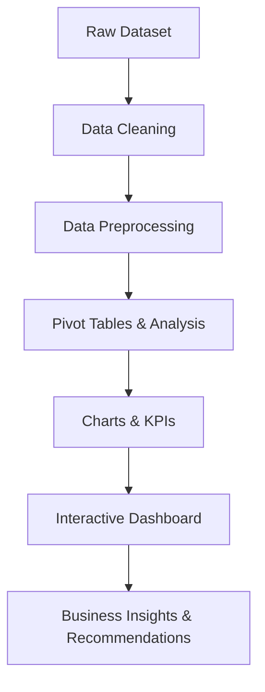

# FNP-Sales-Analysis 📊

## Project Overview
This project focuses on analyzing FNP (Ferns N Petals) sales data using Microsoft Excel. The objective is to identify sales trends, customer purchasing behavior, product performance, and revenue patterns through an interactive dashboard. The insights generated help businesses make informed decisions and improve overall performance.

---

## Project Workflow



---

## Dataset Used

Dataset Link:
https://github.com/OmkarTatkare/FNP-Sales-Analysis/blob/main/project_fnp.xlsx

### Dataset Description

| Column Name | Description |
|------------|-------------|
| Order_ID | Unique identifier for each order |
| Customer_ID | Unique customer identifier |
| Order_Date | Date when order was placed |
| Delivery_Date | Date when order was delivered |
| Product_Name | Product purchased |
| Category | Product category |
| Occasion | Occasion associated with purchase |
| City | Customer city |
| Quantity | Quantity ordered |
| Revenue | Revenue generated from order |

---

## Tools & Technologies Used

- Microsoft Excel
- Pivot Tables
- Pivot Charts
- Slicers
- Conditional Formatting
- Data Validation
- Dashboard Design
- Lookup Functions (VLOOKUP/XLOOKUP)

---

## Repository Structure

```text
FNP-Sales-Analysis/
│
├── data/
│   └── project_fnp.xlsx
│
├── images/
│   └── dashboard.png
│
├── reports/
│   └── project_summary.pdf
│
├── README.md
└── LICENSE
```

---

## Business Questions (KPIs)

- What is the total number of orders?
- What is the total revenue generated?
- What is the average customer spending?
- What is the average order-delivery time?
- Which occasions generate the highest revenue?
- Which months contribute the highest sales?
- Which cities generate the highest number of orders?
- Which product categories contribute maximum revenue?
- Which products generate the highest revenue?
- What are the peak order hours?

---

## Data Cleaning & Preprocessing

- Verified dataset for missing values.
- Removed duplicate records.
- Standardized date formats.
- Checked data consistency across sheets.
- Validated revenue and order values.
- Prepared data for Pivot Table analysis.

---

## Dashboard Features

- KPI Cards
  - Total Orders
  - Total Revenue
  - Average Customer Spend
  - Average Order Delivery Time

- Interactive Slicers
  - Delivery Date
  - Order Date
  - Occasion

- Dynamic Charts
  - Revenue by Occasion
  - Revenue by Month
  - Revenue by Category
  - Revenue by Hour
  - Top Products by Revenue
  - Top Cities by Orders

---

## Dashboard


---

## Key Insights

- Anniversary and Raksha Bandhan generated the highest revenue.
- February and August recorded peak sales performance.
- Colors and Soft Toys were the top revenue-generating categories.
- Evening hours showed the highest customer activity.
- Imphal and Kavali ranked among the top cities based on order volume.
- Average customer spending was approximately ₹3,520.

---

## Final Conclusion

The interactive Excel dashboard provides valuable insights into customer behavior, seasonal demand patterns, and product performance. By leveraging Pivot Tables, Pivot Charts, and dynamic filtering, businesses can identify growth opportunities, optimize inventory planning, and improve marketing strategies through data-driven decision-making.
